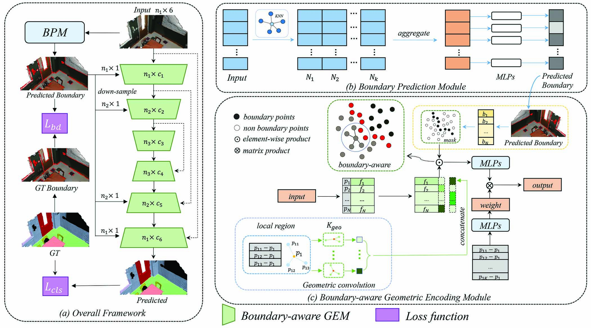

# Boundary-Aware Geometric Encoding for Semantic Segmentation of Point Clouds
by Jingyu Gong*, JiachenXu*, Xin Tan, Jie Zhou, Yanyun Qu, Yuan Xie and Lizhuang Ma. (*=equal contribution)

<p align="center">  </p>

## Installation
The code is based on [PointNet](https://github.com/charlesq34/pointnet)，[PointNet++](https://github.com/charlesq34/pointnet2), and [PointConv](https://github.com/DylanWusee/pointconv). Please install [TensorFlow](https://www.tensorflow.org/install/), and follow the instruction in [PointNet++](https://github.com/charlesq34/pointnet2) to compile the customized TF operators.  
The code has been tested with Python 3.6, TensorFlow 1.13.1, CUDA 10.0 and cuDNN 7.3 on Ubuntu 18.04.

## Usage
### ScanNet DataSet Segmentation

Download the ScanNetv2 dataset from [here](http://www.scan-net.org/), and see `scannet/README` for details of preprocessing.

To train a model to segment Scannet Scenes:

```
CUDA_VISIBLE_DEVICES=0 python train_scannet_IoU.py --model bagem_scannet --log_dir bagem_scannet_ --batch_size 8
```

After training, to evaluate the segmentation IoU accuracies:

```
CUDA_VISIBLE_DEVICES=0 python evaluate_scannet.py --model bagem_scannet --batch_size 8 --model_path bagem_scannet_%s --with_rgb 
```

Modify the model_path to your .ckpt file path.

## License
This repository is released under MIT License (see LICENSE file for details).
